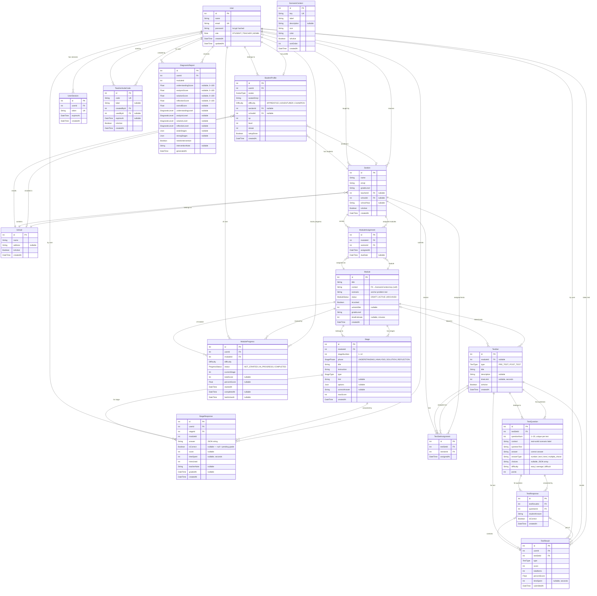
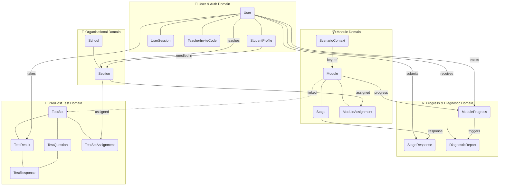

# Entity-Relationship Diagram
## Think–Solve–Reflect (TSR) System
### Chapter 3 — Database Design

> **How to render this diagram:**
> - **VS Code:** Install the [Markdown Preview Mermaid Support](https://marketplace.visualstudio.com/items?itemName=bierner.markdown-mermaid) extension, then open Preview (`Ctrl+Shift+V`).
> - **Online:** Paste the diagram block at [https://mermaid.live](https://mermaid.live) — export as PNG or SVG.
> - **CLI export:** `npx @mermaid-js/mermaid-cli -i docs/ERD.md -o docs/ERD.png`

---

## Full Entity-Relationship Diagram

---

## Simplified Conceptual Diagram

The diagram below groups the 18 models into five functional domains for a high-level thesis overview.

---

## Entity Descriptions

### User Domain

| Model | Table | Description |
|-------|-------|-------------|
| **User** | `users` | Base account for all roles (STUDENT, TEACHER, ADMIN). Stores hashed credentials and role. |
| **StudentProfile** | `student_profiles` | Extended profile for students only. Set during the onboarding wizard. Holds avatar, difficulty level, XP, level, and section enrollment. One-to-one with User. |
| **UserSession** | `user_sessions` | Tracks active JWT sessions. Used for server-side revocation. Token is stored as a unique VarChar(512). |
| **TeacherInviteCode** | `teacher_invite_codes` | One-time codes that gate teacher registration. Consumed on use (`usedById` set, `isActive` cleared). |

### Organisational Domain

| Model | Table | Description |
|-------|-------|-------------|
| **School** | `schools` | Physical school entity. Sections and student profiles are grouped under a school. |
| **Section** | `sections` | A class section (e.g., "Grade 6 – Narra"). Belongs to a school and has one teacher. Students enroll in a section. Modules and test sets are assigned to sections. |

### Module Domain

| Model | Table | Description |
|-------|-------|-------------|
| **ScenarioContext** | `scenario_contexts` | Lookup table for real-world problem contexts (e.g., "Barangay Feeding Program"). Referenced by `Module.context` as a soft key (no FK). |
| **Module** | `modules` | A problem-solving module containing 12 stages. Has a status (DRAFT/ACTIVE/ARCHIVED) and optional lock mechanism. |
| **Stage** | `stages` | One of 12 ordered stages in a module. Belongs to a StagePhase (Understanding/Analysis/Solution/Reflection). Stores question, type-specific options JSON, and correct answer. Unique on (moduleId, stageNumber). |
| **ModuleAssignment** | `module_assignments` | Junction table linking a Module to a Section with an optional due date. Unique on (moduleId, sectionId). |

### Progress & Diagnostic Domain

| Model | Table | Description |
|-------|-------|-------------|
| **ModuleProgress** | `module_progress` | Tracks a student's progress through one module: current stage, total score, percent score, and timestamps. Unique on (userId, moduleId). |
| **StageResponse** | `stage_responses` | Stores a student's answer for one stage. Auto-scored stages populate `score` immediately; open-ended stages wait for teacher grading. Unique on (userId, stageId). |
| **DiagnosticReport** | `diagnostic_reports` | Generated after Stage 12. Groups stage scores into 4 cluster percentages (Understanding, Analysis, Solution, Reflection) with proficiency levels and intervention flags. Unique on (userId, moduleId). |

### Pre/Post Test Domain

| Model | Table | Description |
|-------|-------|-------------|
| **TestSet** | `test_sets` | A timed or untimed set of questions (PRE_TEST or POST_TEST). Optionally linked to a Module. |
| **TestSetAssignment** | `test_set_assignments` | Junction table linking a TestSet to a Section. Students access tests through this assignment. Unique on (testSetId, sectionId). |
| **TestQuestion** | `test_questions` | An individual question within a TestSet. Supports multiple answer types (number, text, time, multiple choice). Unique on (testSetId, questionNum). |
| **TestResult** | `test_results` | A student's completed submission for one TestSet. Records score, total items, and percent score. Unique on (userId, testSetId) — one attempt enforced. |
| **TestResponse** | `test_responses` | Individual answer for one question within a TestResult. Stores the student's answer and whether it was correct. |

---

## Enumerations

| Enum | Values | Used In |
|------|--------|---------|
| `Role` | STUDENT, TEACHER, ADMIN | User |
| `Difficulty` | APPRENTICE, ADVENTURER, CHAMPION | StudentProfile, ModuleProgress |
| `AvatarType` | WIZARD, ELF, HERO, CHAMPION, EXPLORER, FOX, DRAGON, LION, EAGLE, WOLF | StudentProfile |
| `StageType` | MULTIPLE_CHOICE, RANKING, OPEN_ENDED, TABLE_INPUT, CHECKLIST, COMPUTATION, MULTI_PLAN, BUDGET_CHECK, SELECT_JUSTIFY, REFLECTION_SLIDER | Stage |
| `StagePhase` | UNDERSTANDING (Stages 1–3), ANALYSIS (Stages 4–7), SOLUTION (Stages 8–10), REFLECTION (Stages 11–12) | Stage |
| `ModuleStatus` | DRAFT, ACTIVE, ARCHIVED | Module |
| `ProgressStatus` | NOT_STARTED, IN_PROGRESS, COMPLETED | ModuleProgress |
| `DiagnosticLevel` | PROFICIENT (≥80%), DEVELOPING (60–79%), STRUGGLING (<60%) | DiagnosticReport |
| `TestType` | PRE_TEST, POST_TEST | TestSet, TestResult |

---

## Database Table Summary

| Table | Model | Rows represent |
|-------|-------|----------------|
| `users` | User | All system accounts |
| `student_profiles` | StudentProfile | Game setup data per student |
| `user_sessions` | UserSession | Active JWT sessions |
| `teacher_invite_codes` | TeacherInviteCode | One-time teacher registration codes |
| `schools` | School | Physical schools |
| `sections` | Section | Class sections within schools |
| `scenario_contexts` | ScenarioContext | Real-world problem context definitions |
| `modules` | Module | Problem-solving modules |
| `stages` | Stage | Individual stages (1–12) per module |
| `module_assignments` | ModuleAssignment | Module ↔ Section assignments |
| `module_progress` | ModuleProgress | Per-student per-module progress |
| `stage_responses` | StageResponse | Per-student per-stage answers |
| `diagnostic_reports` | DiagnosticReport | Post-completion diagnostic results |
| `test_sets` | TestSet | Pre-test and post-test sets |
| `test_set_assignments` | TestSetAssignment | TestSet ↔ Section assignments |
| `test_questions` | TestQuestion | Individual test questions |
| `test_results` | TestResult | Per-student test submissions |
| `test_responses` | TestResponse | Per-question answers in a submission |
